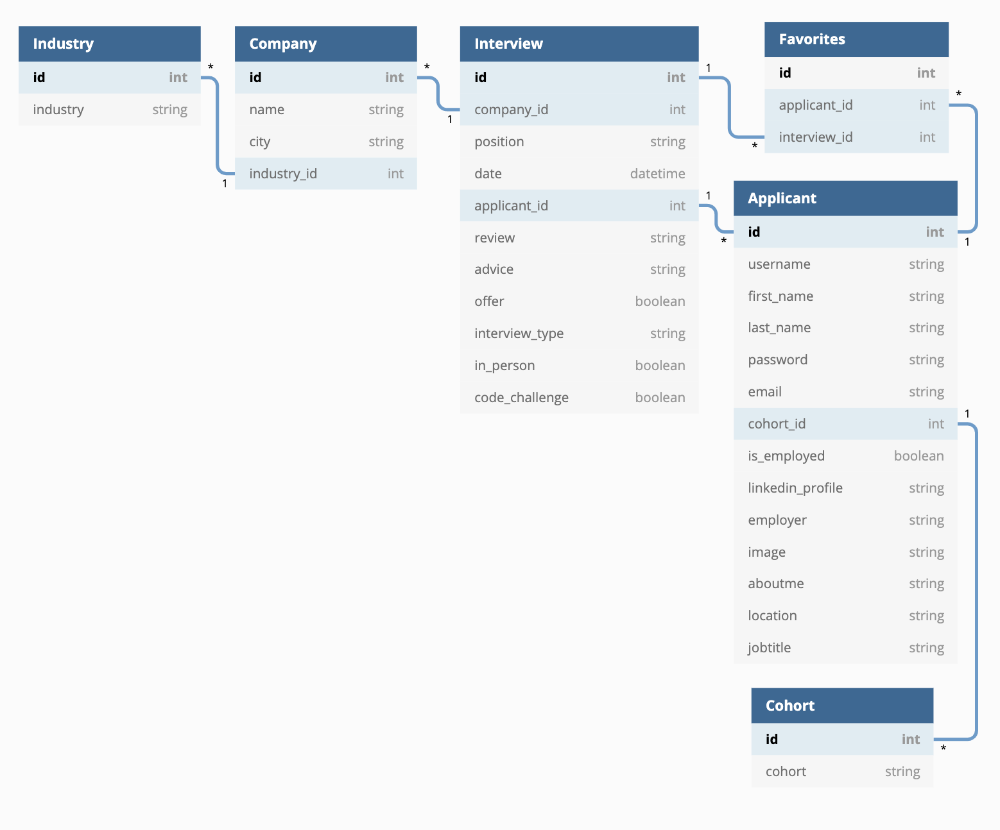

## What is Hive Mind?
Hive Mind is a social media platform that allows Nashville Software School students and alumni to create and share interview "surveys" for interviews that they have had with specific companies. These surveys include information that can be used by students to prepare for their own interviews with specific companies. With Hive Mind, students are able to create their own interview surveys, search for other student's interview surveys by company, save other user's surveys to a favorites board, customize personal profile information, and view other's profiles. 

## Why was Hive Mind created?
As a student who is about to graduate, when the job search process began, one thing that I quickly realized is that it can be hard to know exactly how to prepare for interviews with different companies. Each company has a different way of interviewing, different questions that they ask, and different code challenges and trying to guess the best way to prepare for these interviews can be nerve wracking. This is why I decided to create Hive Mind - a solution to ease the stress that students face during their job search by helping them feel more prepared for the interview process.

## Want to use the Hive Mind API? Follow the steps below to set it up.

1. Create a new directory in your terminal by running `mkdir Hive-Mind-API` and then run `cd Hive-Mind-API`. Clone down this repository by clicking the "Clone or Download" button above, copying the SSH key, and running the following command in your terminal `git clone SSHKEYGOESHERE`.
2. After the clone is finished, run `cd Hive-Mind-Back-End-Capstone-API` in your terminal. 
3. Create your virtual environment by typing the following commands in your terminal:
    - For OSX: 
        - `python -m venv HiveMindEnv`
        - `source ./HiveMindEnv/bin/activate`

    - For Windows:
        - `python -m venv HiveMindEnv`
        - `source ./HiveMindEnv/Scripts/activate`

4. Install the app's dependencies:

  - `pip install -r requirements.txt`

5. Build your database from the existing models:

  - `python manage.py makemigrations hivemindapi`
  - `python manage.py migrate`

6. Create a superuser for your local version of the app:

  - `python manage.py createsuperuser`

7. Populate your database with initial data from fixtures files: (_NOTE: every time you run this it will remove existing data and repopulate the tables_)

  - `python manage.py loaddata */fixtures/*.json`

8. Fire up your dev server and get to work!

  - `python manage.py runserver`

### Front-End Client

9. This API is dependent upon a front-end client. To run the full app, you will need to install and run the front-end client as well. You can find it here with instructions for setup:
https://github.com/laurenriddle/Hive-Mind-Back-End-Capstone-Client

NOTE: All fetch calls need to be made to http://localhost:8000/.
## What can you do with the Hive Mind API? 
### Using the Hive Mind API with its Client
1. Follow the instructions above to download the API and run the client. 

### Using the Hive Mind API Independantly from its Client
1. Follow steps 1-8 above to set up the API and perform all installations needed to run it. 
2. Download Postman (https://www.postman.com/) and then open the app.
3. You will need to register a new user in the database so that you will have an authentication token, which is required for you to communicate with this API. First, in Postman, select the "New" button in the top, left corner. Select type "request", set the request name to "Register" and under collections/folders, create a new folder called "Hive Mind" and select it. Save the request. 
4. Once you create the request, a tab will open up in Postman that allows you to make fetch requests to the database. The first request you need to make is a POST request to http://localhost:8000/register. To do this, you need to set a header, where the key is "Content-Type" and the value is "application/json" (see image #1 below). After you create the header, copy the object below, go to body, select the option for "raw", and paste this object into the body (see image #2 below). 

	- Register Object: 
	`{
		"username": "johnd",
		"first_name": "John",
		"last_name": "Doe",
		"email": "jdoe@gmail.com",
		"password": "123",
		"cohort_id": 1,
		"is_employed": true,
		"image": null,
		"employer": null,
		"aboutme": null,
		"jobtitle": "Software Developer",
		"location": "Nashville",
		"linkedin_profile": null
	}`

5. Once you have the body and header of the request set, make sure you have the URL set to http://localhost:8000/register and the request method is set to POST. When you have these configured, select send. If the register was successful, you will see a token returned in the response section (see image #2 below).

### #1

### #2

6. Once you get a token, copy it and go to your headers settings. Add a new header with the key of "Authorization" and the value of "Token YOURTOKENGOESHERE" (see image #3 below).

### #3

7. Once you have your token, you will then have access to all of the fetch calls available for the API. If you want to make a fetch call. simply input into Postman the URL you would like to make the fetch call to, pass your token and content-type in the header, and (if you are making a POST or a PUT) pass the object that you would like to send to the database in the body of the request. 

8. A complete list of URLs to which you can send request is available in the documentaion below. The properties for each table in the database are available in the ERD below as well. 

## Hive Mind Documentation 
### Entity Relationship Diagram

## Tech Stack 

&nbsp&nbsp&nbsp&nbsp&nbsp&nbsp&nbsp&nbsp&nbsp&nbsp&nbsp&nbsp&nbsp&nbsp&nbsp&nbsp&nbsp&nbsp&nbsp&nbsp&nbsp&nbsp&nbsp&nbsp&nbsp&nbsp&nbsp&nbsp&nbsp&nbsp&nbsp&nbsp&nbsp&nbsp&nbsp&nbsp&nbsp&nbsp&nbsp&nbsp

&nbsp&nbsp&nbsp&nbsp&nbsp&nbsp&nbsp&nbsp&nbsp&nbsp&nbsp&nbsp&nbsp&nbsp&nbsp&nbsp&nbsp&nbsp&nbsp&nbsp&nbsp&nbsp&nbsp&nbsp&nbsp&nbsp&nbsp&nbsp&nbsp&nbsp&nbsp&nbsp

©2019 - Lauren Riddle

